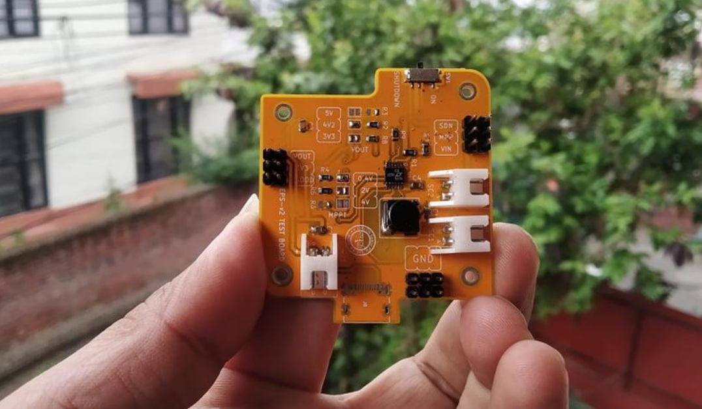
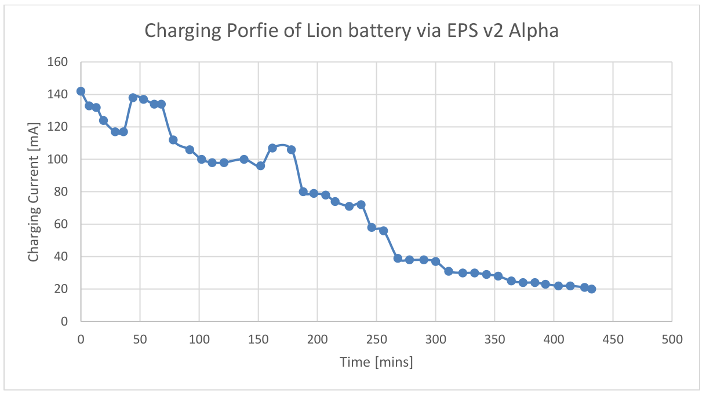
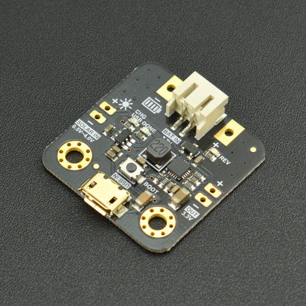

# Selection of MPPT Chip
Date: 16 Jan, 2022

Due to chip shortage due to the COVID 19 Pandemeic we have to have many options regarding the chips we are using in our system. Currently in the beginning of 2022 we are facing same issue and we want to have an option to the MPPT chip that we are currently using.
We currently have SPV1040 in our EPS board in NEPALPQ-1: PocketQube Training Kit.

## Objective of the study
- To find a chip that can work as an option to the SPV1040
- It should be easily available in aliexpress/ arrow/ or digikey/ mouser.

## Main features of SPV1040 that is required from other chips
- 0.3 V to 5.5 V operating input voltage
- uses embedded hardware MPPT to charge the battery

## Some additional features of SPV1040 that we like
- 95% efficient
- Charging can be shut down
- Reverse polarity protection in the input side
- Simple circuit and does not contain many components
- Easy to solder becasue of its TSSOP8 package.

## Some considerations 
- Due to the chip shortage, we might have to go to the extent that we have to select a boost converter that boosts the voltage of approx 2V to the required voltage and a Li-ion battery charger that charges the battery.

## Comparative Table

| Parameters                | SPV1040          | LTC3105               | SPV1050 |          ADP5090 |
| -----------               | -----------      |-----------            | ------------ |------------ |
| Input Voltage Range [V]   | 0.3-5.5          |0.22-5                 | 0.45-5.5 * |0.1-3.6 |
| Package                | TSSOP8              | Yes                   | VFQFPN [3X3] |16-Lead LFCSP |
| Uses MPPT?                | Yes              | Yes                   | Yes |Yes |
| Price[$]                  | 3.5 Euro [Mouser]           | 6.5 Euro               | 3.9$ [digikey] |5.88 Euro [mouser] |
| Availability **              | available in mouser             |    available in mouser, aliexpress            | aliexpress [expensive] |available in mouser, arrow   |

Some other options include ADP5091, ADP5092. ***
- ** As of Jan 2022

## Some Premilinary Studies and Designs
### 1. LTC3105
In this, we desgined a board that can be suitable for our purose for EPS and evaluated the evaluation board that we designed.

The board has been tested and the results are as follows:

### 2. SPV1050
In this we orderd a board from dfrobot that uses SPV105 and evaluated that board.

## Boost Converters
To convert the 2V from the solar panel we can also use boost converter. Here we try to find the high efficient boost converter which can be paired with a battery charger that charges the battery in the EPS board.
| Parameters                | L6920          | 
| -----------               | -----------               |
| Input Voltage Range [V]   | 0.6-5.5         |
| Package                | TSSOP8              | 
| Price[$]                  | 1.8$ [aliexpress] 
| Availability **              | available in aliexpress             |    
| Additional Features                | Shut Down Pin, Reverse input voltage protection, low voltage detection at input, 3.3v and 5V fixed or adjustable output voltage [2-5.2V]  |

- ** As of Jan 2022

While using boost converter we also need to use battery chargers in parrallel to connect the voltage to the battery.

## Battery Charger
This chip will charge a 1-cell Li-ion battery and stop after the charging has been completed.
| Parameters                | MCP73831T          | 
| -----------               | -----------               |
| Input Voltage Range [V]   | 3.75-6        |
| Output Voltage [V]   |4.2, 4.35, 4.4, 4.5       |
| Package                | SOT-23-5, DFN              | 
| Price[$]                  | 0.2$ [aliexpress] 
| Availability **              | available in aliexpress |          |    

- ** As of Jan 2022

## Recomendation
1. Option-1: Use LTC3105
2. Option-2: Use L6920 and MCP73831T

# Comments from Stuart

## Requirements:
Determine suitable MPPT for 1P and 3P

## Constraints:
1P has limited capacity due to the size of the solar panels. Based on Sanosat-1 and other 1P Pocketqubes, the output per panel has the following limits:
 - Panel output approx 350mW max
 - Panel voltage under 5V
 - Current per panel of approx 150mA ( depends on solar cell voltage)
 
3P with body mounted solar panels has much larger surface area. PocketQubes like Delfi-PQ have 2 x Azurspace 8x4cm 30% efficient solar cells. Each cell is approx 1.2W, and can either be wired
 in series or parallel. Either 2.4V or 4.8V (MPPT) and peak voltage of 2.7 or 5.4v. Current would range from .5A to 1A. 
 Lower cost panels would generally have specifications below the space-grade solar cells. 
 The 3P MPPT would need to have this minimum capacity. 
 
 
 ## Discussion:
 1P Options
 These option have already been identified:
 SPV1040
 LTC3105
 SPV1050
 ADP5090
 
 Many MPPT chips fall within the "Energy Harvesting" category. These are designed for very small circuits, so the IC's often have limitations when used on PQ application.
 
 eg. ADP5090 can only support max 3.3v input and 200mW capacity. SPV1050 only support a max current of 70mA. 
 
 A typical 1P radio has a 100mW transmitter and requires 280mW of DC power. At 3.3v, this is 85mA. The EPS of the satellite would need to separate the power generation and discharge so that 
 too much current isn't drawn from a single panel ( which would cause a brown-out)
 
 Some additional options for 1P, along with notes about the device:
 
## MAXIM MAX20361
 Suppots up to 3v input ( although recommended is 2.5v). approx 300mW capacity. I2C control ( less external components required). WLCSP package hard to solder and expensive PCB. 
 Datasheet: https://datasheets.maximintegrated.com/en/ds/MAX20361.pdf
## E-PEAS AEM10941
 0.38-5V input. max input current of 110mA, but 550mW input power handling ( so better to have higher voltage solar panels). More complicated chip so more external components required. 
 Datasheet: https://www.fujitsu.com/uk/Images/DS_AEM10941_REV1.2.pdf
 
 Some additional options for 3P, along with notes about the device:
 
 ## Analog Devices LTC3119
 2.5-18v input V. MAx 15W capacity, so lots of headroom. Much larger chip. Used on Birds Cubesats from Japan. 
 Datasheet: https://www.analog.com/media/en/technical-documentation/data-sheets/3119fb.pdf
 ## Analog Devices LTC3130-1
 Similar power capacity to SPV1040 but higher voltages. 2.4-25v input. Buck-Boost converter, not just boost. 600mA output curent limit.
 Datasheet: https://www.analog.com/media/en/technical-documentation/data-sheets/3119fb.pdf
 
 ## Texas Instruments TPS61200
 plain old Boost converter. 0.5 - 5.5v. No MPPT......BUT..... TI published a design note https://www.ti.com/lit/an/slva345b/slva345b.pdf to add MPP functionality. 
 3W output. Same capacity as SPV1040. Smaller package, but additional components required for MPP functionality. 
 Datasheet: https://www.sparkfun.com/datasheets/Prototyping/tps61200.pdf
## References
- SPV1040 Datasheet
-  *https://www.st.com/en/power-management/energy-harvesting-and-solar-charging-ics.html#overview
-  *** https://www.analog.com/en/parametricsearch/11503#/p5573=20m|1&p5574=500m|5
